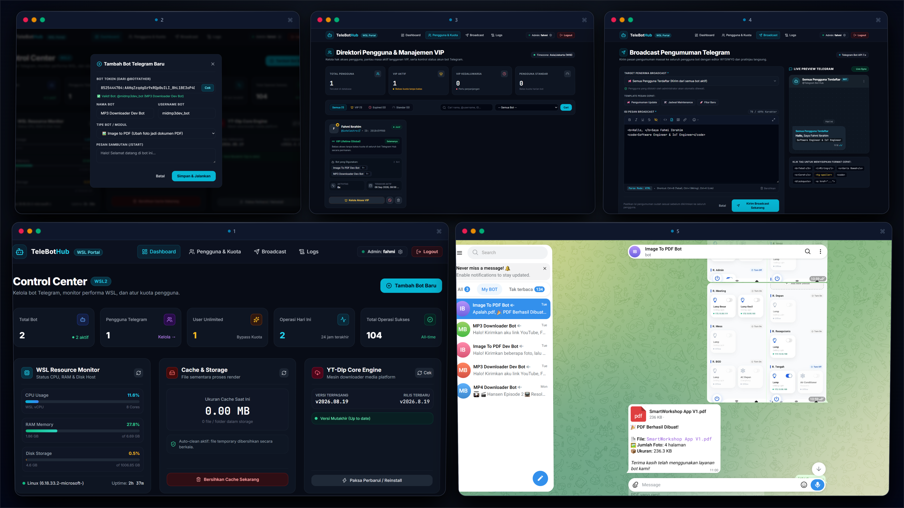

<p align="center">
  
</p>

# 🤖 Telegram Bot Hub Portal

Platform manajemen multi-bot Telegram modular dengan Web Dashboard interaktif.
Dibangun menggunakan **Python 3**, **FastAPI**, **aiogram 3**, **SQLite**, **yt-dlp**, **Pillow**, **img2pdf**, **psutil**, **Chart.js**, dan **FFmpeg**.

---

## 🌟 Fitur Lengkap Portal

1. **Web Dashboard Dinamis (Port 8000)**:
   * **Sistem Login Keamanan**: Autentikasi sesi signed cookie (dapat diubah melalui halaman Profil atau environment variable).
   * **Live Bot Management**: Tambah, ubah token, ubah tipe bot, dan hapus bot kapan saja.
   * **Start / Stop Toggle**: Menghidupkan atau mematikan worker polling masing-masing bot secara real-time tanpa me-restart server.
   * **Auto Check Token**: Memeriksa token bot langsung ke Telegram API dan mengisi otomatis nama & username bot.
   * **Server Health Monitor**: Widget pemantau beban CPU (%), RAM (Used/Total), dan Disk (Used/Total) pada environment WSL2 secara real-time.
   * **Storage & Cache Cleaner**: Menghitung ukuran file sementara di folder `storage/` serta tombol pembersihan cache sekali klik.
   * **Visual Analytics (Chart.js)**: Grafik garis tren aktivitas 7 hari terakhir dan diagram donat distribusi kategori bot.

2. **Manajemen Pengguna & Kuota Fleksibel**:
   * **Direktori Pengguna Telegram**: Mencatat otomatis semua pengguna yang berinteraksi dengan bot.
   * **Pengaturan Kuota Harian**: Setiap bot dapat diatur batas operasinya per user per hari (misal 5x/hari atau 0 untuk unlimited).
   * **Fitur User VIP / Unlimited**: Admin dapat memberikan akses **UNLIMITED** kepada pengguna tertentu hanya dengan 1 klik tombol toggle, sehingga user tersebut bebas dari batasan kuota harian.
   * **Ban & Block Spammer**: Fitur blokir user tertentu agar tidak dapat menggunakan bot.

3. **Fitur Broadcast Massal**:
   * Kirim pesan pengumuman/informasi langsung ke seluruh pengguna terdaftar atau ke pengguna bot tertentu.
   * Dukungan format pesan Telegram HTML lengkap (tebal, miring, tautan link, kode).

4. **Dukungan Modul Bot**:
   * 🖼️ **Image to PDF Bot (`img2pdf`)**:
     * Penggabungan multiple foto menjadi 1 file PDF rapi tanpa spam pesan.
     * Tombol interaktif dinamis di bagian paling bawah chat.
     * Pengurutan halaman akurat berdasarkan waktu pengiriman foto.
     * Pengaturan nama file kustom sebelum konversi PDF.
   * 🎵 **Audio MP3 Downloader (`mp3`)**:
     * Download audio dari berbagai platform media (YouTube, TikTok, Instagram, dll).
     * Tombol pilihan bitrate: `128 kbps`, `192 kbps`, dan `320 kbps (High Quality)`.
     * Pengaturan nama file kustom sebelum unduhan diproses.
   * 🎬 **Video MP4 Downloader (`mp4`)**:
     * Download video dari tautan media.
     * Tombol pilihan resolusi: `360p (Ringan)`, `720p HD`, dan `1080p Full HD`.
     * Pengaturan nama file video kustom.

---

## 🚀 Cara Menjalankan Aplikasi

1. Salin file environment:
```bash
cp .env.example .env
# Sesuaikan kredensial admin dan port di file .env jika diinginkan
```

2. Jalankan server:
```bash
cd ~/projects/telegram-bot-hub
./run.sh
```

Aplikasi dan dashboard otomatis berjalan di:
👉 **http://localhost:8000** *(Bisa dibuka langsung dari Google Chrome / Edge di browser Windows)*

* **Default Username:** `admin` *(atau sesuai `ADMIN_USERNAME` di `.env`)*
* **Default Password:** `admin123` *(atau sesuai `ADMIN_PASSWORD` di `.env`)*

---

## 📁 Struktur Direktori

```text
telegram-bot-hub/
├── app/
│   ├── main.py               # Server FastAPI, Web Routes, dan System Health API
│   ├── database.py           # Skema SQLite, User Tracking, Kuota Unlimited & Analytics
│   ├── auth.py               # Autentikasi sesi signed cookie dashboard
│   ├── bot_manager.py        # Lifecycle polling aiogram dinamis & Broadcast Engine
│   ├── handlers/
│   │   ├── img2pdf.py        # Logika Image to PDF dengan Quota & User Tracking
│   │   ├── mp3_downloader.py # Logika MP3 Downloader dengan Quota & Bitrate Choice
│   │   ├── mp4_downloader.py # Logika MP4 Downloader dengan Quota & Resolution Choice
│   │   └── common.py         # Helper sanitasi nama file & direktori storage
│   └── templates/
│       ├── base.html         # Template layout dengan navigasi & Chart.js
│       ├── login.html        # Halaman login modern
│       ├── dashboard.html    # Dashboard utama (Health Widget, Storage, Analytics, Bot list)
│       ├── users.html        # Halaman Manajemen Pengguna Telegram & Kuota Unlimited
│       ├── broadcast.html    # Halaman Broadcast Pesan Massal
│       ├── profile.html      # Halaman Pengaturan Akun & Password Admin
│       ├── bot_edit.html     # Halaman edit konfigurasi bot & kuota harian
│       └── logs.html         # Halaman riwayat aktivitas bot
├── data/
│   └── bots.db               # Database SQLite
├── storage/                  # Direktori cache sementara proses media
├── run.sh                    # Script launcher utama
└── requirements.txt
```
